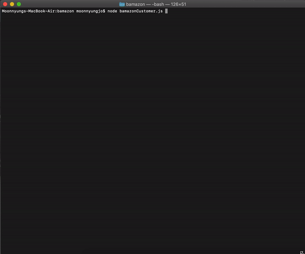
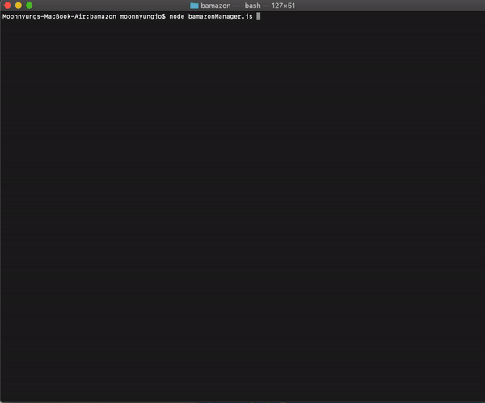
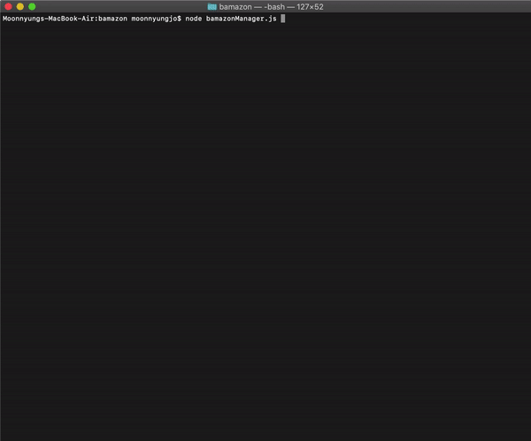

## Bamazon

In this activity, you'll be creating an Amazon-like storefront with the MySQL skills I learned this unit. The app will take in orders from customers and deplete stock from the store's inventory.

### Challenge #1: Customer View

Running this application will first display all of the items available for sale. Include the ids, names, and prices of products for sale.
Once the customer has placed the order, your application should check if your store has enough of the product to meet the customer's request.

- If not, the app should log a phrase like `Insufficient quantity!`, and then prevent the order from going through.

### Challenge #2: Manager View

- List a set of menu options:

  - View Products for Sale

  - View Low Inventory

  - Add to Inventory

  - Add New Product

- `View Products for Sale`

- `View Low Inventory`

- `Add to Inventory`

- `Add New Product`

